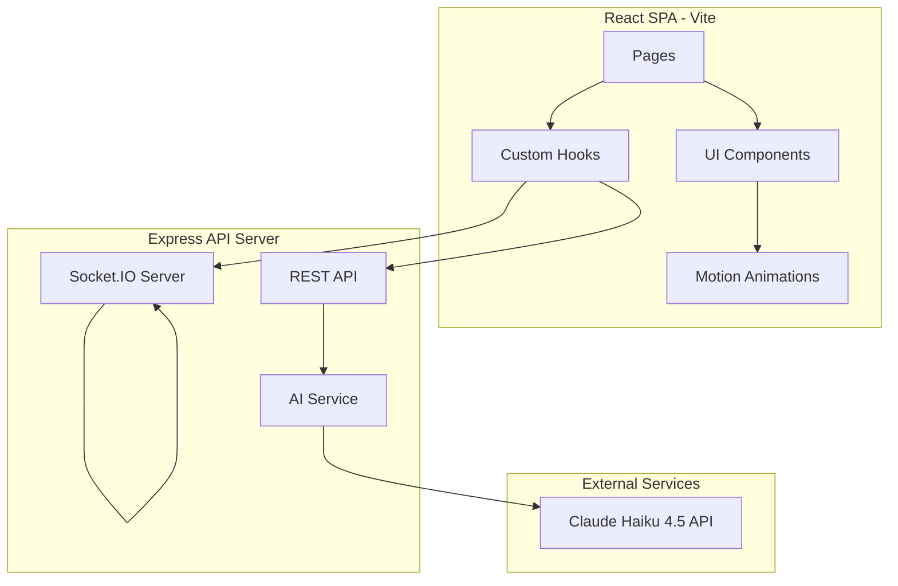
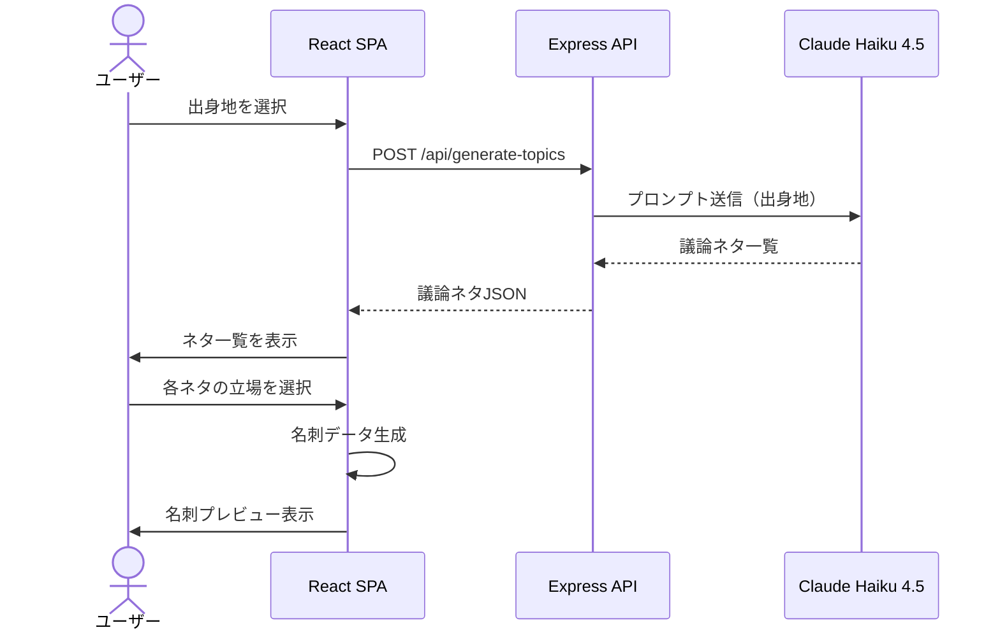
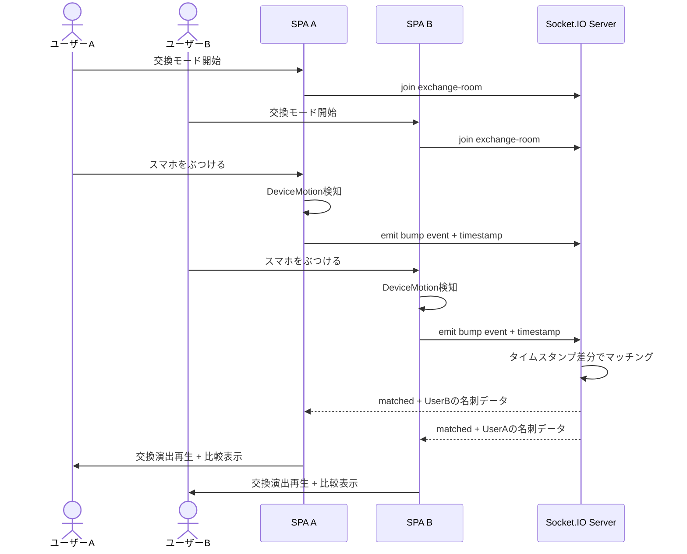
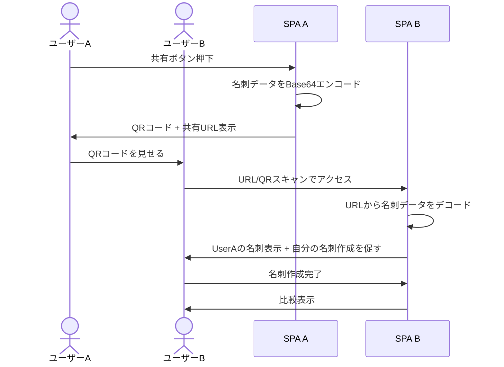
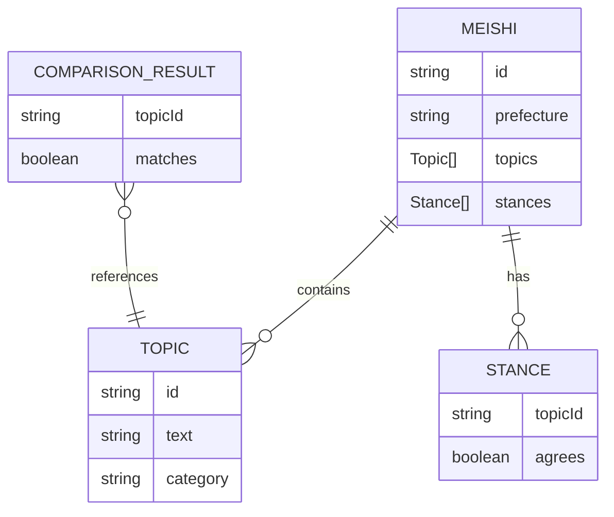

# Design Document

## Overview

**Purpose**: 出身地を入力するとAIが議論ネタを生成し、「地元名刺」を作成・交換・比較することで、初対面の対面シーンで会話が広がる体験を提供する。

**Users**: 地方出身の新生活者（大学入学・就職等）が、初対面の相手と会話のきっかけを作るために使用する。

**Impact**: SNSのコンテンツ量に依存しない、出身地ベースの新しい自己紹介・交流手段を提供する。

### Goals
- 出身地入力から名刺完成まで1分以内で完了する体験
- スマホをぶつけて交換する物理的な驚きと演出のドキドキ感
- 比較表示による即座の会話のきっかけ創出
- Webブラウザだけで完結（インストール・ログイン不要）

### Non-Goals
- ユーザーアカウント管理・ログイン機能
- データベースへの永続保存
- ネイティブアプリ対応
- 交換履歴の長期保存
- グループ交換（3人以上の同時交換）

## Architecture

### Architecture Pattern & Boundary Map



**Architecture Integration**:
- **Selected pattern**: SPA + 軽量APIサーバー。ハッカソンの開発速度と2人チーム分担に最適
- **Domain boundaries**: フロントエンド（名刺作成UI・交換演出）とバックエンド（AI生成・WebSocketマッチング）で分離
- **Existing patterns preserved**: steering/structure.mdの画面単位分担開発に準拠
- **Steering compliance**: TypeScript strict mode、ログイン不要、DB不要の方針に準拠

### Technology Stack

| Layer | Choice / Version | Role in Feature | Notes |
|-------|------------------|-----------------|-------|
| Frontend | React 19 + Vite 6 + TypeScript | SPA構築・画面描画 | strict mode有効 |
| Routing | React Router v7 | クライアントサイドルーティング | 画面遷移管理 |
| Animation | Motion v12 | 交換演出・UIアニメーション | 旧Framer Motion |
| QR Code | qrcode.react v4 | 名刺共有QRコード生成 | SVGレンダリング |
| Backend | Express + Node.js | REST API・静的ファイル配信 | 軽量APIサーバー |
| WebSocket | Socket.IO v4 | ぶつけマッチング・名刺交換 | ルーム管理内蔵 |
| AI | Claude Haiku 4.5 API | 議論ネタ生成 | Anthropic SDK |
| Styling | Tailwind CSS v4 | ユーティリティファーストCSS | モバイルファースト |

> 詳細な選定理由は `research.md` の Design Decisions セクションを参照。

## System Flows

### 名刺作成フロー



### ぶつけ交換フロー



### URL/QR交換フロー



## Requirements Traceability

| Requirement | Summary | Components | Interfaces | Flows |
|-------------|---------|------------|------------|-------|
| 1.1, 1.2, 1.3 | 出身地入力 | PrefectureSelectPage | — | 名刺作成フロー |
| 2.1, 2.2, 2.3, 2.4 | AI議論ネタ生成 | TopicGenerationPage, AIService | GenerateTopicsAPI | 名刺作成フロー |
| 3.1, 3.2, 3.3 | 立場選択・名刺完成 | StanceSelectPage, MeishiCard | MeishiData型 | 名刺作成フロー |
| 4.1, 4.2, 4.3 | 名刺共有URL/QR | SharePage | MeishiEncoder | URL/QR交換フロー |
| 5.1, 5.2, 5.3, 5.4, 5.5 | ぶつけ交換 | ExchangePage, useBumpDetection, useExchangeSocket | BumpEvent, SocketEvents | ぶつけ交換フロー |
| 6.1, 6.2, 6.3, 6.4 | 交換演出 | ExchangeAnimation | AnimationSequence | ぶつけ交換フロー |
| 7.1, 7.2, 7.3, 7.4 | 比較表示 | ComparisonPage | ComparisonResult | 両交換フロー |
| 8.1, 8.2, 8.3, 8.4 | モバイル・ブラウザ完結 | 全コンポーネント | — | — |

## Components and Interfaces

| Component | Domain | Intent | Req Coverage | Key Dependencies | Contracts |
|-----------|--------|--------|--------------|------------------|-----------|
| PrefectureSelectPage | UI/Pages | 都道府県選択画面 | 1.1-1.3 | — | State |
| TopicGenerationPage | UI/Pages | ネタ生成・表示画面 | 2.1-2.4 | AIService (P0) | State |
| StanceSelectPage | UI/Pages | 立場選択画面 | 3.1-3.3 | — | State |
| MeishiCard | UI/Components | 名刺カード表示 | 3.3 | — | — |
| SharePage | UI/Pages | QR/URL共有画面 | 4.1-4.3 | MeishiEncoder (P0), qrcode.react (P1) | State |
| ExchangePage | UI/Pages | ぶつけ交換画面 | 5.1-5.5 | useBumpDetection (P0), useExchangeSocket (P0) | State |
| ExchangeAnimation | UI/Components | 交換演出 | 6.1-6.4 | Motion (P0) | State |
| ComparisonPage | UI/Pages | 比較表示画面 | 7.1-7.4 | — | State |
| useBumpDetection | Hooks | DeviceMotion衝撃検知 | 5.2 | DeviceMotion API (P0) | Service |
| useExchangeSocket | Hooks | Socket.IO交換通信 | 5.2-5.3 | Socket.IO Client (P0) | Service |
| MeishiEncoder | Utils | 名刺データURL変換 | 4.1 | — | Service |
| AIService | Server | AI議論ネタ生成API | 2.1-2.4 | Claude API (P0) | API |
| ExchangeSocketServer | Server | ぶつけマッチング | 5.2-5.3 | Socket.IO (P0) | Service, Event |

### Hooks Layer

#### useBumpDetection

| Field | Detail |
|-------|--------|
| Intent | DeviceMotion APIで加速度を監視し、閾値超過でbumpイベントを発火 |
| Requirements | 5.2 |

**Responsibilities & Constraints**
- DeviceMotion APIの初期化とpermission request（iOS Safari対応）
- 加速度の合成値（x² + y² + z²の平方根）が閾値を超えたらbump判定
- デバウンス処理で連続検知を防止（500ms）

**Contracts**: Service [x]

##### Service Interface
```typescript
interface BumpDetectionResult {
  readonly isSupported: boolean;
  readonly permissionState: 'prompt' | 'granted' | 'denied';
  readonly isListening: boolean;
}

interface UseBumpDetectionOptions {
  readonly threshold: number;       // 加速度閾値（デフォルト: 15）
  readonly debounceMs: number;      // デバウンス間隔（デフォルト: 500）
  readonly onBump: () => void;      // bump検知コールバック
}

type UseBumpDetection = (options: UseBumpDetectionOptions) => BumpDetectionResult & {
  readonly requestPermission: () => Promise<boolean>;
  readonly startListening: () => void;
  readonly stopListening: () => void;
};
```

**Implementation Notes**
- iOS Safari: `DeviceMotionEvent.requestPermission()`をユーザージェスチャー起点で呼出
- 非対応デバイス: `isSupported: false`を返しUIレベルでフォールバック案内

#### useExchangeSocket

| Field | Detail |
|-------|--------|
| Intent | Socket.IO接続管理とぶつけマッチングのイベントハンドリング |
| Requirements | 5.2, 5.3 |

**Contracts**: Service [x] / Event [x]

##### Service Interface
```typescript
interface ExchangeSocketState {
  readonly isConnected: boolean;
  readonly isWaiting: boolean;
  readonly isMatched: boolean;
  readonly partnerMeishi: MeishiData | null;
}

type UseExchangeSocket = (myMeishi: MeishiData) => ExchangeSocketState & {
  readonly joinRoom: () => void;
  readonly sendBump: () => void;
  readonly leaveRoom: () => void;
};
```

##### Event Contract
- **Published events**: `bump` (クライアント→サーバー、タイムスタンプ付き)
- **Subscribed events**: `matched` (サーバー→クライアント、相手の名刺データ付き), `timeout` (マッチング失敗)
- **Delivery guarantees**: Socket.IO自動再接続。マッチングは3秒ウィンドウ内

### Utils Layer

#### MeishiEncoder

| Field | Detail |
|-------|--------|
| Intent | 名刺データのURLセーフなエンコード/デコード |
| Requirements | 4.1 |

**Contracts**: Service [x]

##### Service Interface
```typescript
interface MeishiEncoder {
  readonly encode: (data: MeishiData) => string;
  readonly decode: (encoded: string) => MeishiData;
  readonly toShareUrl: (data: MeishiData) => string;
}
```
- Preconditions: MeishiDataが完全に入力済み
- Postconditions: エンコード→デコードで元データと一致（可逆性保証）

### Server Layer

#### AIService

| Field | Detail |
|-------|--------|
| Intent | Claude Haiku 4.5 APIを使って出身地から議論ネタを生成 |
| Requirements | 2.1, 2.2, 2.3, 2.4 |

**Dependencies**
- External: Anthropic SDK (@anthropic-ai/sdk) — Claude API呼出 (P0)

**Contracts**: API [x]

##### API Contract
| Method | Endpoint | Request | Response | Errors |
|--------|----------|---------|----------|--------|
| POST | /api/generate-topics | `{ prefecture: string }` | `{ topics: Topic[] }` | 400 (無効な県名), 500 (AI API障害), 429 (レート制限) |

```typescript
interface Topic {
  readonly id: string;
  readonly text: string;          // 議論ネタ本文
  readonly category: string;      // カテゴリ（食文化・方言・習慣等）
}

interface GenerateTopicsResponse {
  readonly topics: ReadonlyArray<Topic>;
  readonly prefecture: string;
}
```

**Implementation Notes**
- APIキーはサーバー環境変数 `ANTHROPIC_API_KEY` で管理
- プロンプトで3〜5個のネタを生成するよう指示
- JSON形式でレスポンスを返すようプロンプト設計

#### ExchangeSocketServer

| Field | Detail |
|-------|--------|
| Intent | Socket.IOによるぶつけマッチングの管理 |
| Requirements | 5.2, 5.3 |

**Contracts**: Service [x] / Event [x]

##### Event Contract
- **Subscribed events**: `join-exchange`, `bump` (タイムスタンプ + 名刺データ)
- **Published events**: `matched` (両クライアントへ相手の名刺データ), `timeout`
- **マッチングロジック**: `bump`イベントのタイムスタンプが3秒以内の2クライアントをペアリング

## Data Models

### Domain Model



### Logical Data Model

```typescript
interface MeishiData {
  readonly id: string;
  readonly prefecture: string;
  readonly topics: ReadonlyArray<TopicWithStance>;
  readonly createdAt: string;    // ISO 8601
}

interface TopicWithStance {
  readonly topic: Topic;
  readonly agrees: boolean;
}

interface ComparisonResult {
  readonly myMeishi: MeishiData;
  readonly partnerMeishi: MeishiData;
  readonly matches: ReadonlyArray<TopicMatch>;
  readonly matchCount: number;
  readonly mismatchCount: number;
}

interface TopicMatch {
  readonly topicText: string;
  readonly category: string;
  readonly myStance: boolean;
  readonly partnerStance: boolean;
  readonly isMatch: boolean;
}
```

**Consistency & Integrity**
- 名刺データはURL内にBase64エンコードして保持（永続化不要）
- 交換セッションはサーバーのインメモリMap（サーバー再起動で消失、許容範囲）
- 比較結果はクライアントサイドで算出

## Error Handling

### Error Strategy
フロントエンドでのユーザーフレンドリーなエラー表示を優先。サーバーサイドはコンソールログ。

### Error Categories and Responses
**User Errors (4xx)**: 無効な都道府県入力 → 選択UIで防止 / DeviceMotion未許可 → 許可取得UIを再表示
**System Errors (5xx)**: AI API障害 → 「ネタ生成に失敗しました。再試行してください」/ WebSocket切断 → 自動再接続 + 「接続中...」表示
**Device Errors**: DeviceMotion非対応 → URL/QR交換へのフォールバック案内

## Testing Strategy

### Unit Tests
- MeishiEncoder: encode/decode可逆性、不正入力バリデーション
- ComparisonResult算出: 一致/不一致判定ロジック
- Topic型バリデーション

### Integration Tests
- POST /api/generate-topics: Claude APIとの統合（モック使用）
- Socket.IOマッチング: 2クライアント同時bump → matched イベント発火

### E2E Tests
- 名刺作成フロー: 都道府県選択 → ネタ生成 → 立場選択 → 名刺完成
- URL/QR共有フロー: 共有URL生成 → 別タブでアクセス → 名刺表示
- 比較表示: 2つの名刺の一致/不一致ハイライト確認
